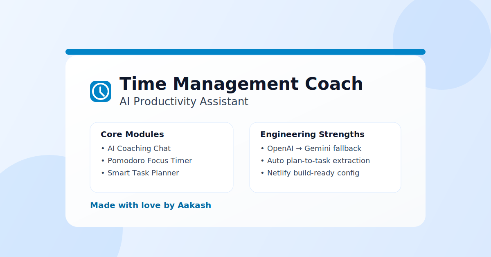
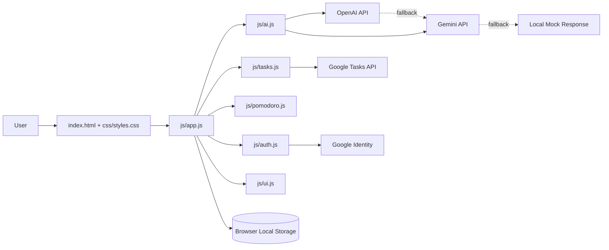

# Time Management Coach

Time Management Coach is a frontend productivity app that combines AI coaching, task management, and Pomodoro focus sessions in one interface.



## Features

- AI coaching chat with provider fallback (OpenAI -> Gemini -> local fallback)
- Task manager with optional Google Tasks sync
- Pomodoro timer (focus and break modes)
- Conversation memory for better follow-up responses
- Tasks are added only when user explicitly asks

## Architecture Diagram



## How It Works

1. User messages are handled in js/app.js.
2. AI responses are generated through js/ai.js with provider fallback.
3. Responses are shown in chat and optionally converted to tasks only on explicit user request.
4. Tasks and UI state are managed through js/tasks.js and js/ui.js.
5. Focus sessions are controlled by js/pomodoro.js.

## Tech Stack

- HTML, Tailwind CSS, custom CSS
- Vanilla JavaScript (modular files in js/)
- OpenAI API and Gemini API
- Optional Google Identity + Google Tasks

## Quick Start

1. Clone the repository.
2. Create config.js in project root (or copy config.example.js).
3. Add your API keys.
4. Run with a local server.

Example config.js:

```javascript
window.CONFIG = {
  OPENAI_API_KEY: "sk-your-openai-key",
  GEMINI_API_KEY: "AIza-your-gemini-key",
  GOOGLE_CLIENT_ID: "your-google-client-id.apps.googleusercontent.com",
  API_TIMEOUT: 10000,
  MAX_RETRIES: 2,
  RETRY_DELAY: 1000,
};
```

Run locally:

```bash
python -m http.server 5500
```

Open http://localhost:5500

## Configuration Notes

- Keep config.js local and private.
- Do not commit real API keys.
- For production, route provider calls through a backend proxy.

## Typical Usage

1. Ask the coach for a plan (for example, a 7-day study plan).
2. If you want tasks saved, explicitly ask: add this plan to my tasks.
3. Track execution with the Pomodoro timer and task list.

## Project Files

- index.html - app shell
- css/styles.css - styling
- js/app.js - app event wiring
- js/ai.js - AI response flow and fallback
- js/tasks.js - task operations
- js/pomodoro.js - timer logic
- js/auth.js - Google auth/session handling
- js/ui.js - UI helpers
