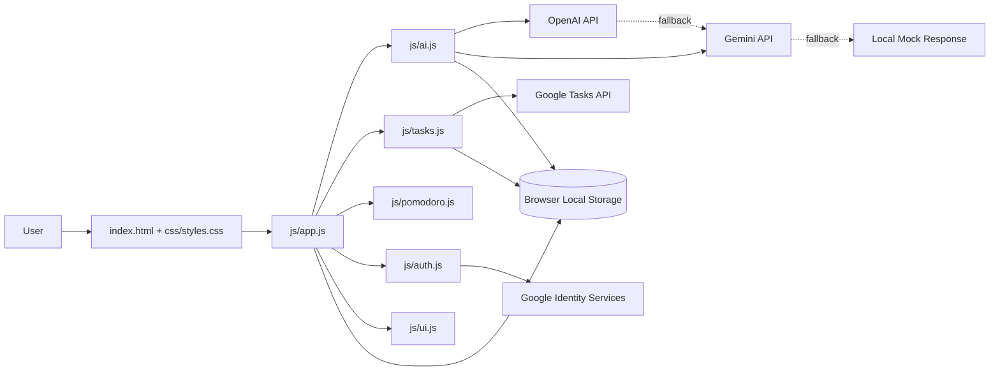

# Time Management Coach

Time Management Coach is a production-style frontend application that combines AI guidance, execution tooling, and progress management in one workflow. It is designed to help users turn coaching advice into actionable daily plans.


## Why This Project Stands Out

- Converts coaching conversation into execution by turning plan responses into concrete tasks.
- Uses resilient AI routing: OpenAI as primary provider with Gemini fallback and local mock safety net.
- Keeps the full focus loop in one interface: coaching, planning, task tracking, and Pomodoro sessions.
- Demonstrates practical frontend architecture with modular JavaScript and deployment-ready config handling.

## Highlights

- Multi-provider AI pipeline: OpenAI primary with Gemini fallback and resilient local mock response.
- Structured coaching output: sectioned responses with actionable, timeline-based steps.
- Smart task extraction: automatically converts plan-style AI responses into task items.
- Productivity stack in one app: Pomodoro timer, personal task board, and conversational coach.
- Optional Google integration: sign-in and task sync for cloud-backed workflows.

## Tech Stack

- Frontend: HTML5, Tailwind CSS, custom CSS
- Application Logic: Vanilla JavaScript (modular files under js/)
- APIs: OpenAI Chat Completions, Gemini Generate Content
- Auth/Tasks: Google Identity Services + Google Tasks API (optional)
- Deployment: Netlify-ready with environment-driven config generation

## Live Demo

- Demo URL: https://time-management-coach.pages.dev
- Recommended walkthrough:
  1. Ask for a 5-day or 7-day plan in AI Coach.
  2. Verify auto-generated tasks appear in My Tasks.
  3. Run one Pomodoro session and switch to short break mode.

## Architecture Diagram



## Architecture Overview

- UI shell and layout: `index.html`
- Styling system and reusable component classes: `css/styles.css`
- App orchestration and event wiring: `js/app.js`
- AI provider routing and response formatting: `js/ai.js`
- Auth/session flow: `js/auth.js`
- Task operations and sync: `js/tasks.js`
- Pomodoro logic: `js/pomodoro.js`
- UI rendering helpers: `js/ui.js`

## Project Structure

- `index.html` - main app shell
- `js/ai.js` - AI provider logic and fallback flow
- `js/app.js` - app event wiring and chat/schedule interactions
- `js/auth.js` - Google auth and session handling
- `js/tasks.js` - task operations
- `js/pomodoro.js` - timer logic
- `js/ui.js` - chat/task UI helpers
- `config.example.js` - template config
- `config.js` - local secret config (not committed)

## Prerequisites

- Modern browser (Chrome/Edge/Firefox)
- OpenAI API key (recommended)
- Gemini API key (fallback)
- Google OAuth Client ID (optional, only for Google sign-in/tasks)

## Setup

1. Clone the repository.
2. Create `config.js` in project root (or copy from `config.example.js`).
3. Add your real keys.
4. Run from a local HTTP server (recommended) instead of opening as `file:///`.

## Environment Variables (Netlify/CI)

This project supports environment-variable based config generation through `build.sh`.

- Netlify runs `build.sh` (configured in [netlify.toml](netlify.toml)) and creates `config.js` at build time.
- Set these environment variables in Netlify site settings:
  - `OPENAI_API_KEY`
  - `GEMINI_API_KEY`
  - `GOOGLE_CLIENT_ID` (optional)

Important for local development:

- Browser JavaScript cannot read your machine environment variables directly.
- Locally, either create `config.js` manually or run a script that generates it before serving the app.

### config.js Example

```javascript
window.CONFIG = {
  OPENAI_API_KEY: "sk-your-openai-key",
  GEMINI_API_KEY: "AIza-your-gemini-key",
  GOOGLE_CLIENT_ID: "your-google-client-id.apps.googleusercontent.com",
  API_TIMEOUT: 10000,
  MAX_RETRIES: 2,
  RETRY_DELAY: 1000,
};
```

## Run Locally

### Option A: VS Code Live Server

- Install Live Server extension
- Right-click `index.html` -> Open with Live Server

### Option B: Python HTTP server

```bash
python -m http.server 5500
```

Then open:

- `http://localhost:5500`

## AI Chat Flow

The app handles AI providers in this order:

1. OpenAI (`/v1/chat/completions`)
2. Gemini (`generativelanguage.googleapis.com`)
3. Local mock response (last fallback)

This means chat remains usable even if one provider fails or rate-limits.

### Intelligent Task Updates

When you ask for plan-style guidance (for example 5-day or 7-day plans), the app now:

- Returns a structured coaching response with sections
- Extracts actionable plan items from the response
- Adds those items into your task list automatically (with duplicate checks)

This works for both local task mode and Google Tasks mode.

## Common Issues

### Chatbot not responding

Check the following:

1. `config.js` exists in project root.
2. Keys are real values, not placeholders.
3. Browser DevTools Console has no startup errors.
4. Network tab shows API calls being made.
5. You are serving over `http://localhost` (not opening raw file path).

### OpenAI errors (401/429)

- 401: key invalid or revoked
- 429: rate limit/quota reached

When this happens, app should automatically fall back to Gemini.

### Gemini errors (400/403/404/429)

- 400/403: key or API permissions issue
- 404: model unavailable for your key/project
- 429: rate limit

If Gemini also fails, app returns a safe mock response.

### Google login not working

- Ensure `GOOGLE_CLIENT_ID` is set in `config.js`
- Verify OAuth credentials in Google Cloud Console
- Add `http://localhost:<port>` to authorized origins

## Security Notes

- Never commit real API keys.
- Keep `config.js` local/private.
- Rotate keys if they were accidentally exposed.

## Deployment Notes

For production, do not expose API keys directly in frontend JS.
Use a backend proxy/serverless function for provider calls and keep secrets server-side.

## License

Use and modify for personal or educational productivity workflows.

## Resume-Ready Positioning

If you want to present this project on your resume or portfolio, focus on these outcomes:

- Built a resilient AI coaching experience using provider fallback and graceful degradation.
- Implemented automatic plan-to-task extraction to convert conversational output into execution.
- Designed an integrated productivity UI with chat, timer, and task workflows in a single-page app.
- Added deployment-ready config handling for local development and Netlify builds.

## Resume Bullets (SDE-Ready)

- Engineered a modular JavaScript SPA integrating AI coaching, Pomodoro timing, and task orchestration, improving maintainability through clear separation across app, AI, UI, auth, and task modules.
- Built a fault-tolerant LLM pipeline with OpenAI primary, Gemini fallback, and local mock recovery, preserving core chat functionality during provider outages and quota failures.
- Implemented prompt-to-task automation with parsing, normalization, and duplicate checks to transform natural-language plans into actionable task objects in near real time.

## Key Challenges Solved

- Challenge: AI provider outages and rate limits could break the user flow.
  Solution: Added multi-layer fallback order with graceful degradation to ensure users always receive a usable response.

- Challenge: LLM responses are often verbose but not directly executable.
  Solution: Implemented extraction logic that detects structured day/block items and converts them into task entries with due dates.

- Challenge: Follow-up prompts lacked continuity in stateless API calls.
  Solution: Added bounded conversation memory in local storage and injected recent context into provider prompts.

- Challenge: Frontend deployments can accidentally expose config errors.
  Solution: Added deployment-ready config generation flow and startup guard behavior for missing keys.

## Engineering Metrics (Code-Level)

- AI reliability layers: 3 levels (OpenAI -> Gemini -> local fallback).
- Conversation continuity: stores up to 8 recent turns for context-aware follow-up responses.
- Auto-task extraction cap: up to 8 actionable tasks per relevant coaching response.
- Duplicate prevention: task title normalization and dedupe check before inserting generated items.

## Portfolio Summary

Use this one-liner in your portfolio:

Built an AI productivity web app that unifies coaching chat, Pomodoro focus cycles, and smart task extraction with multi-provider fallback for resilient user experience.
